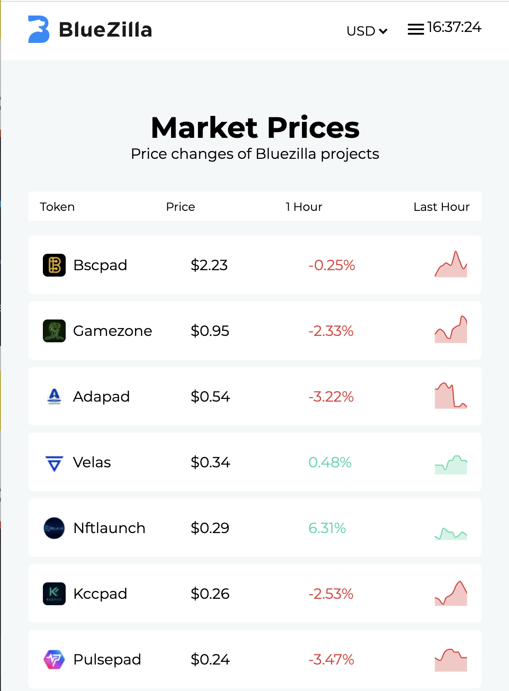
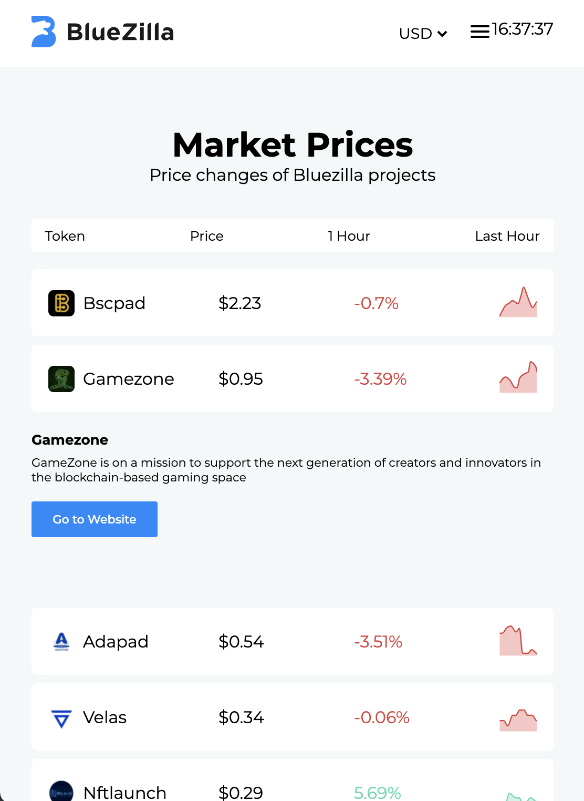

## Functional programming

_Shields that represent my project - They change over time._ (https://shields.io/)

      

## Description
This project is a front-end application that shows the rates of coins powered by the company BlueZilla. It is certainly not finished but very active to improve.

### Concept
The concept is to create a community app where people can discuss the prices and what they think of bluezilla and certain projects.

## Table of Contents

- [Install](#install)
- [Used Tools](#used-tools)
- [Visuals](#visuals)
- [!important files](#mportant-files)
- [Meta](#meta)
- [License](#license)

## Install

Clone the GitHub Repo locally

```
git clone https://github.com/TristanVarewijck/functional-programming
```

Install the Packages

```
npm i 
```

Start the Server

```
npm run start
```

## Used Tools

- [git](https://git-scm.com/)
- [react](https://reactjs.org/)
- [json](https://www.json.org/json-en.html)
- [node](https://nodejs.org/en/)
- [d3](https://d3js.org/)

## Visuals

Screenshot app: 


Screenshot accordion: 


## !mportant files

See the components folder to find out how the project is structured. 

[COMPONENTS](https://github.com/TristanVarewijck/bluezilla-analytics/tree/main/src/components)

## Meta

Tristan Varewijck - tristan.varewijck@gmail.com - https://github.com/TristanVarewijck/bluezilla-analytics


## License

Usage is provided under the [MIT License](https://github.com/git/git-scm.com/blob/master/MIT-LICENSE.txt) MIT.
